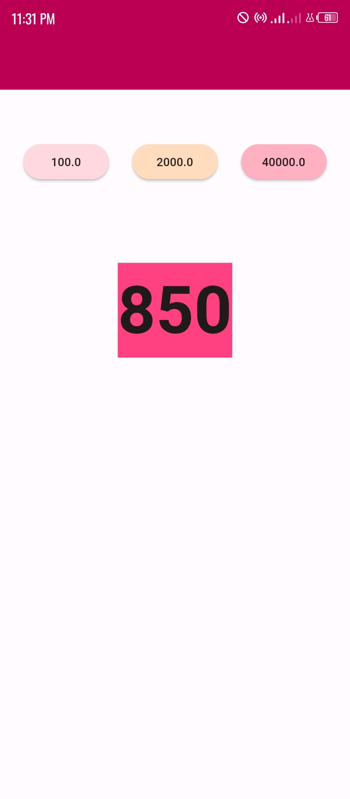

## text_animator

A Flutter Animated Text Package which helps to give life to values that can passed as data to Flutter Text widget or any other value or string receivable widget.

## Features

- Number counter animation
- Text transformation animation

### Screenshots



## Getting started

Add to your pubspec.yaml file the dependency:

```yaml

dependencies:
  flutter:
    sdk: flutter

  text_animator:
    git:
      url: git@github.com:kenresoft/text_animator.git
      ref: release

```

## Usage

Complete Examples on uasge of this package can be found in the [Example](example) folder.

```dart

Widget widget = TextAnimator(
  initial: 50,
  value: state.data,
  initializeToValue: false,
  duration: const Duration(seconds: 5),
  builder: (BuildContext context, value) {
    return Text(
      value,
      style: const TextStyle(
        backgroundColor: Colors.pinkAccent,
        fontWeight: FontWeight.bold,
        fontSize: 80,
      ),
    );
  },
);
```

## Additional information

NOTE: This package is still under development.
